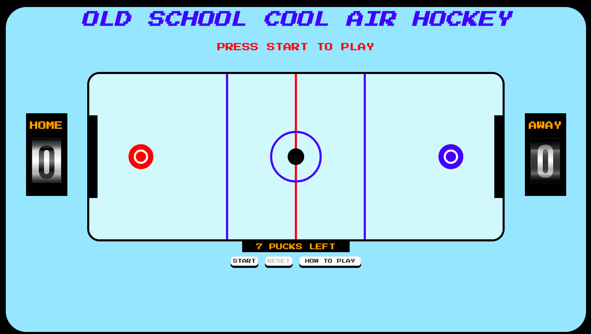

# OLD SCHOOL COOL AIR HOCKEY

### About

Old school cool air hockey is a 2 player air hockey game. The object of the game is to score the puck into the opposite players goal. Each player is awareded 1 point per goal and the game is a series of best of 7. The win, the player must score 4 goals before their opponent. 

### List of Technologies Used For the Game
- HTML5
- JavaScript
- CSS
- jQuery
- Animate.css

### Getting Started

[Link to Old School Cool Air Hockey]()

Controls:

There are 2 human controlled players in this game: the Home Team and Away Team.

To control the Home Team, the W A S D keys on the keyboard are used to control the Up, Down, Left, and Right movement of the paddle.

To control the Away Team, the Up, Down, Left, and Right arrow keys are used to control the paddle.

### Next Steps 

Planned future enhancements:
- Have users input a name or select between a list of teams
- Update the design of the background to be more representative of a scoreboard
- Update the score display of the home and away team to be animated like a timer on a scoreboard
    
